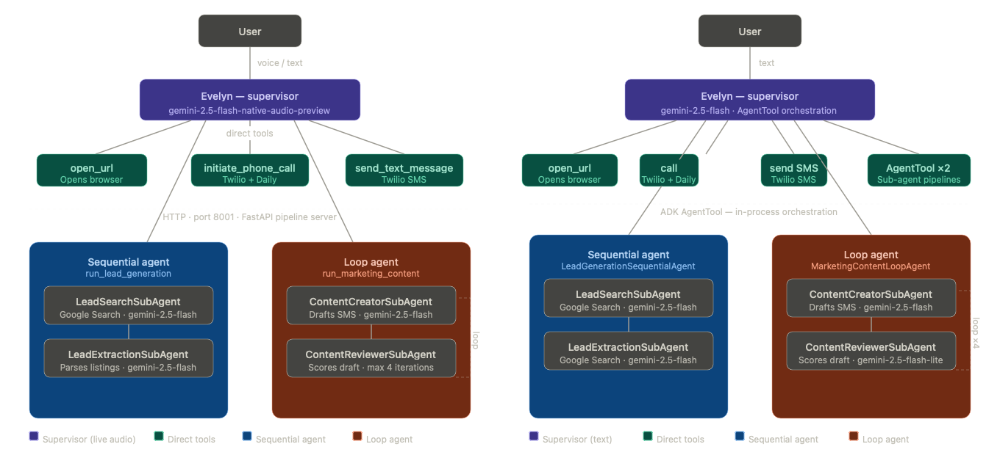
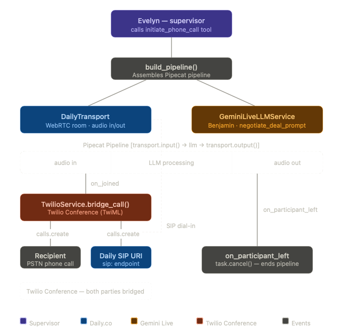

# Syntax Realty Company
A lead generation and outreach tool used to find For-Sale-By-Owner for any given area and reach out to the via voice-ai phone call or text.

### Examples
- Assistants will try to find you home For-Sale-By-Owner (FSBO) for a given location.
- You can ask the assistant to make AI phone calls to the home-owner.
- You can ask the assistant to open home listings in a browser.
- You can ask the assistant to send `carefully` crafted text messages to the home-owner.

### Setup Instructions
- Use a Python 3.11 interpreter for best compatibility.
- If running on mac, run the `Install Certificates.command`file inside `/Applications/Python 3.11` folder.

### Run Instructions
- In the terminal type `adk web` to launch Web UI.
- Select the  `home_leads_gen_text_agent` or `home_leads_gen_voice_agent` from the dropdown menu (if voice selected, DO NOT TEXT).
- Turn Mic on to speak with the assistant for voice assistant.

# Multi-Agent System (MAS) - Architecture


# Voice AI Phone Call - Architecture


# Third-Party Service Setup
### Create a Twilio account
1. Purchase a phone number with Voice capabilities — this becomes your TWILIO_CALLER_ID
2. Copy your Account SID and Auth Token from the Twilio Console dashboard
3. Add to your .env:

```
TWILIO_ACCOUNT_SID=your_account_sid
TWILIO_AUTH_TOKEN=your_auth_token
TWILIO_CALLER_ID=+1xxxxxxxxxx
```
### Create a Daily.co account
1. From the Daily dashboard, copy your API Key
2. Ensure your plan has SIP interconnect enabled — this is required for Twilio to bridge calls into Daily rooms
3. Add to your .env:

```
DAILY_API_KEY=your_api_key
DAILY_API_URL=https://api.daily.co/v1
```
### .env Example
- You need 2 .env copies in the root directories for `home_leads_gen_text_agent` and `home_leads_gen_voice_agent`.
```
GOOGLE_GENAI_USE_VERTEXAI=0
GOOGLE_API_KEY=AIzaSyA-...
DAILY_DOMAIN="....daily.co"
DAILY_API_KEY="123abc..."
TWILIO_ACCOUNT_SID="AC...."
TWILIO_AUTH_TOKEN="123abc..."
TWILIO_CALLER_ID="+12485557777"
```

### ⚠️ Architecture Disclaimers
*Why do we use a separate pipeline server instead of Traditional Google ADK AgentTools?*
- The native-audio preview models do not support AgentTool. The work around is to use a non-standard dual-server (FastAPI & `ADK Web` command) 
- So, the Google ADK web server runs on port 8000 while a separate FastAPI pipeline server runs on port 8001.
- Yes, the limitation could've been avoided using `gemini-2.0-flash-live-001`, but the user experience from `gemini-flash-live-2.5-native-audio-preview` is what I preferred.
*Why does text assistant reference files in the voice-assistant?*
- Because the ADK Web command puts any .py files/folders in the dropdown, when selecting the agent. Files are organized this way to avoid confusion.

### Kill SubAgent Server when your done working:
lsof -ti:8000 | xargs kill -9
lsof -ti:8001 | xargs kill -9